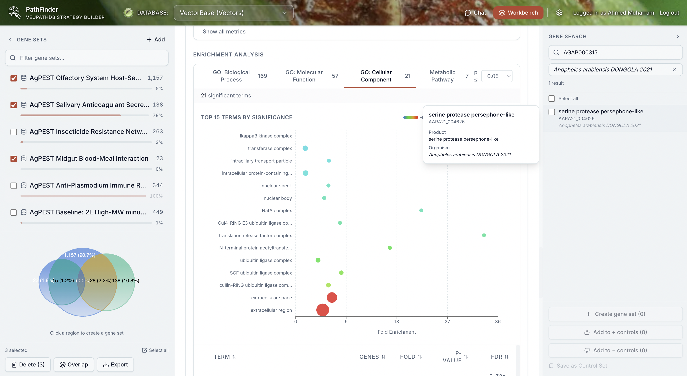

<div align="center">
  <h1>
    
    PathFinder
  </h1>
  <p>An open-source tool-calling LLM agent for planning and building VEuPathDB search strategies (WDK strategy graphs).</p>
  <p><strong><em>Linguistic Vagueness in Tool-Calling LLM Agents, Chapter II</em></strong></p>
  <p>
    
    
    
    
    
    
    
    
  </p>
    <p>
    
  </p>

</div>

PathFinder’s goal is to make complex query/strategy construction **easier, faster, and more reliable** by combining:

- **Planning-first interaction** (clarify intent, propose an executable plan, save reusable artifacts)
- **Execution with real tools** (build/edit a real strategy graph via validated tool calls)
- **Catalog grounding** (live WDK catalog + optional Qdrant RAG for fast discovery and examples)

This project is intended to be integrated with **VEuPathDB systems** in the future once the research prototype is sufficiently mature.

## What’s in this repo

This repo is organized as:

- **`apps/api/`**: FastAPI backend (“Pathfinder API”)
  - SSE chat endpoint (`/api/v1/chat`) streams agent output and tool events.
  - Two agent modes:
    - **Execute mode**: build/edit strategy graphs (WDK strategy semantics).
    - **Plan mode**: collaborative planning and “delegation plan drafts” (no graph mutation by default).
- **`apps/web/`**: Next.js UI
  - Chat UI for both **plan** and **execute** modes.
  - Strategy graph UI + step editing + result panes (varies by features enabled).
  - Proxies API routes via Next rewrites (see `apps/web/next.config.js`).
- **`packages/shared-ts/`**: shared TypeScript types (and OpenAPI tooling)
  - The web app imports types via TS path mapping to `packages/shared-ts/src` (see `apps/web/tsconfig.json`).
- **`packages/shared-py/`**: shared Pydantic models (Python)
- **`packages/spec/`**: OpenAPI spec (`packages/spec/openapi.yaml`)

## How it works (high level)

### Two modes: plan vs execute

- **Plan mode** (planner agent) is optimized for:
  - clarifying ambiguous goals (“linguistic vagueness”)
  - exploring the catalog (record types, searches, parameters)
  - saving reusable **planning artifacts** (markdown summaries, assumptions, parameter choices)
  - drafting a **delegation plan** that can be handed to the executor

- **Execute mode** (executor agent) is optimized for:
  - creating/updating **strategy graph steps** via tool calls
  - validating parameter correctness against WDK search specs
  - running multi-step builds using **delegation** (sub-agent orchestration)

### Streaming + tool events

The API streams **Server-Sent Events (SSE)** for:

- assistant deltas and final messages
- tool call start/end (including tool results)
- “derived” UI events emitted from tool results (e.g., planning artifacts, citations, graph snapshots)

Key entrypoints:

- API app: `apps/api/src/veupath_chatbot/main.py`
- Chat orchestration: `apps/api/src/veupath_chatbot/services/chat/orchestrator.py`
- SSE streaming: `apps/api/src/veupath_chatbot/transport/http/streaming.py`
- Planner tools registry: `apps/api/src/veupath_chatbot/ai/tools/planner_registry.py`
- Graph step creation + validation: `apps/api/src/veupath_chatbot/ai/tools/strategy_tools/step_ops.py`

### VEuPathDB + optional RAG

PathFinder can discover catalog/search metadata via:

- **Live WDK** calls (authoritative)
- **Qdrant RAG** (fast semantic retrieval; may be stale/incomplete)

RAG is controlled by a single setting named `rag_enabled` in `apps/api/config.toml` (see `apps/api/src/veupath_chatbot/platform/config.py`).

## Running locally

### Prerequisites

- **Docker** (recommended for Postgres, Qdrant, and the full stack)
- **Python 3.14+**
- **Node.js 24+**

### Code quality (recommended)

Enable local formatting/linting hooks so issues are caught before push:

```bash
cd apps/api
uv sync --extra dev
cd ../web
npm install
cd ../..
uv run pre-commit install --hook-type pre-commit --hook-type pre-push
```

### Configuration

There are two configuration sources for the API:

- **TOML**: `apps/api/config.toml` (checked in)
- **Environment**: `.env` (not checked in; examples exist)

Examples:

- `apps/api/.env.example`
- `apps/web/.env.example`

Docker Compose will pick up variables from a repo-root `.env` file (if present) and/or your shell environment. In practice your `.env` should contain **at least**:

- **API**
  - `API_SECRET_KEY` (32+ chars)
  - `OPENAI_API_KEY` (required for default planning + RAG embeddings; or set `ANTHROPIC_API_KEY` / `GEMINI_API_KEY` and change planning provider/model)
- **Web**
  - `NEXT_PUBLIC_API_URL=http://localhost:8000`
- **Optional / common**
  - `DATABASE_URL` (defaults to PostgreSQL on `localhost:5432` if unset)
  - `QDRANT_URL` / `QDRANT_API_KEY` (only needed if you’re not using the docker-compose defaults)
  - Startup-ingestion tuning is configured in `apps/api/config.toml` (keys: `rag_startup_*`)

### Option A: run everything with Docker Compose (recommended)

From repo root:

```bash
docker compose up --build
```

- Web: `http://localhost:3000`
- API: `http://localhost:8000`
  - Docs: `http://localhost:8000/docs`
  - Health: `http://localhost:8000/health`

Notes:

- Compose includes **Postgres + Qdrant** by default.

### Populate Qdrant (RAG ingestion)

PathFinder supports RAG for:

- **WDK catalog** ingestion (record types + searches)
- **Example plans** ingestion (public strategies → searchable examples)

By default, ingestion runs **automatically in the API at startup** (in the background) when:

- `rag_enabled=true` (default)
- **`OPENAI_API_KEY` is set** (required for embeddings)

Manual ingestion is usually unnecessary unless you want to reset/rebuild the collections.

```bash
# Full reset + rebuild of Qdrant collections (WDK + example plans)
docker compose --profile ingest run --rm rag_reindex
```

Notes:

- Both jobs require **`OPENAI_API_KEY`** (embeddings).
- The manual reindex writes a JSONL report under `apps/api/ingest_reports/` (gitignored).

### Option B: run API + Web directly (no Docker)

API:

```bash
cd apps/api
uv sync --extra dev
uv run uvicorn veupath_chatbot.main:app --reload --host 0.0.0.0 --port 8000
```

If you’re not running the full stack via Docker Compose, you still need local services:

```bash
docker compose up -d db qdrant
```

Web:

```bash
cd apps/web
npm ci
npm run dev
```

## Testing, linting, typechecking

### API (Python)

```bash
cd apps/api
uv run pytest
uv run ruff check .
uv run mypy src
```

### Web (TypeScript)

```bash
cd apps/web
npm run lint
npm run typecheck
npm test
```

## OpenAPI + shared types

- OpenAPI spec: `packages/spec/openapi.yaml`
- Generate/update shared TS types from the spec:

```bash
cd packages/shared-ts
npm ci
npm run generate:openapi
```

The web app also uses path-based imports for shared TS types (see `apps/web/tsconfig.json`) and Next transpilation settings (`apps/web/next.config.js`).

## Roadmap / what’s missing (by design, for now)

PathFinder is a research-driven prototype. These are the biggest gaps you should expect today:

- **CI/CD**: GitHub Actions workflows exist (see `.github/workflows/ci.yml`).
- **License**: no `LICENSE` file yet (important for a truly open-source distribution).
- **Contribution docs**: no `CONTRIBUTING.md`, no governance/release process.
- **Production hardening**
  - readiness endpoint notes missing DB/Redis checks (`/health/ready` TODO)
  - no documented deployment path (containers, reverse proxy, secrets management)
  - limited auth story (VEuPathDB auth integration is evolving)
- **Database migrations**: schema is created via SQLAlchemy `create_all`; Alembic is listed as a dependency but not set up as a migrations workflow.
- **Qdrant in Docker**: RAG is implemented, ingestion scripts exist, and Qdrant is included in `docker-compose.yml`.
- **Evaluation** (thesis): reproducible experiments/benchmarks, datasets, and metrics for “vagueness” handling are not yet packaged as a part of the suite.

If you’re looking for “good first PRs”, adding CI (pytest/ruff/mypy + web lint/typecheck/tests) and formalizing licensing/docs would be the highest impact.

## Thesis context: “Linguistic Vagueness in Tool-Calling LLM Agents”

PathFinder is built around the idea that ambiguous or underspecified requests are normal when humans describe complex strategies. The system therefore emphasizes:

- **planning as a first-class mode** (artifacts, drafts, structured delegation plans)
- **catalog grounding** (reduce hallucinated tool names/parameters)
- **validation and error shaping** (turn tool failures into actionable, structured feedback)
- **decomposition + delegation** (break complex goals into smaller strategy subproblems)

## Security & privacy notes (current state)

- Do not commit secrets: `.env` is gitignored.
- Model provider keys are read from env/TOML settings.
- Strategy/chat content may be persisted in the configured DB; treat logs and DB contents accordingly.

## Acknowledgements

PathFinder builds on:

- **VEuPathDB / WDK** concepts and APIs (strategy graphs, searches, parameter specs)
- **FastAPI** (API) and **Next.js** (web UI)
- **Kani** for tool-calling agent orchestration
