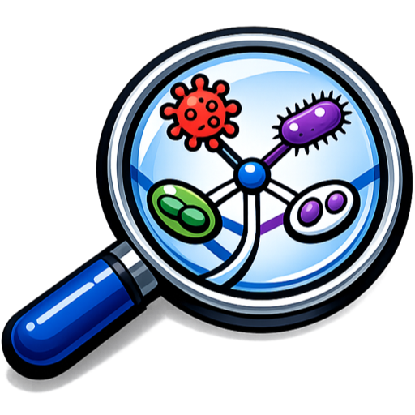
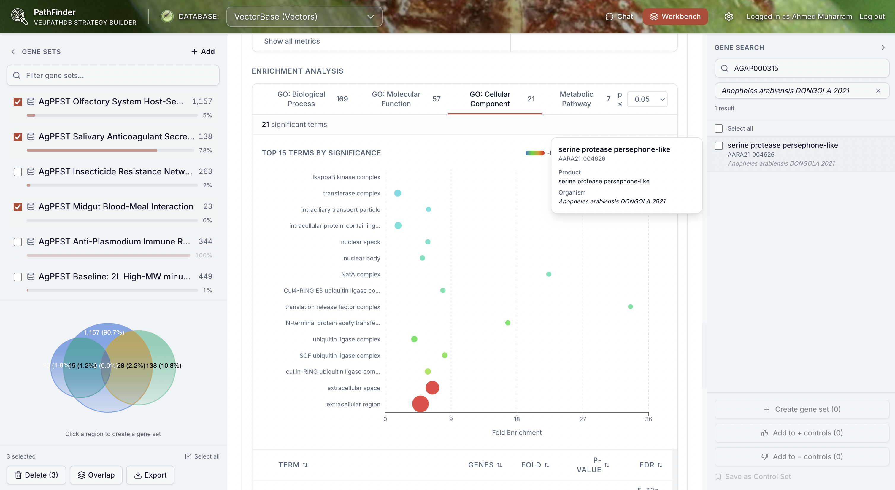

<div align="center">
  <h1>
    
    PathFinder
  </h1>
  <p>An open-source tool-calling LLM agent for constructing VEuPathDB search strategies.</p>
  <p><strong><em>How Underspecified Prompts Shape Tool-Calling LLM Agents in Scientific Workflows</em></strong></p>
  <p>
    
    
    
    
    
    
    
    
    
    
    
    
  </p>
    <p>
    
  </p>

</div>

PathFinder’s goal is to make complex query/strategy construction **easier, faster, and more reliable** by combining:

- **Unified agent** (a single agent that researches, plans, and executes as needed per turn)
- **Execution with real tools** (build/edit a real strategy graph via validated tool calls)
- **Catalog grounding** (live WDK catalog + optional Qdrant RAG for fast discovery and examples)

This project is intended to be integrated with **VEuPathDB systems** in the future once the research prototype is sufficiently mature.

## What’s in this repo

This repo is organized as:

- **`apps/api/`**: FastAPI backend (“Pathfinder API”)
  - SSE chat endpoint (`/api/v1/chat`) streams agent output and tool events.
  - A single **unified agent** that can research, plan, and execute tool calls -- the model decides which capability to use on each turn.
- **`apps/web/`**: Next.js UI
  - Chat UI with strategy graph visualization, step editing, and result panes.
  - **Workbench** for gene set management and multi-panel analysis (enrichment, distributions, cross-validation).
  - Proxies API routes via Next rewrites (see `apps/web/next.config.js`).
- **`packages/shared-ts/`**: shared TypeScript types (and OpenAPI tooling)
  - The web app imports types via TS path mapping to `packages/shared-ts/src` (see `apps/web/tsconfig.json`).
- **`packages/shared-py/`**: shared Pydantic models (Python)
- **`packages/spec/`**: OpenAPI spec (`packages/spec/openapi.yaml`)

The API also includes: gene set management, evaluation engine (metrics, cross-validation, enrichment), export tools, model catalog with token metrics, and workbench chat.

## How it works

### Unified agent

PathFinder uses a **single unified agent** that has access to all tools (research, planning, and execution) and decides which to invoke on each turn. The model uses its judgment to:

- **Research**: explore the catalog, clarify ambiguous goals, discover record types / searches / parameters
- **Plan**: save planning artifacts (markdown summaries, assumptions, parameter choices), reason about strategy structure
- **Execute**: create/update **strategy graph steps** via tool calls, validate parameters against WDK search specs, run multi-step builds using **delegation** (sub-agent orchestration)

### Streaming + tool events

The API streams **Server-Sent Events (SSE)** for:

- assistant deltas and final messages
- tool call start/end (including tool results)
- “derived” UI events emitted from tool results (e.g., planning artifacts, citations, graph snapshots)

Key entrypoints:

- API app: `apps/api/src/veupath_chatbot/main.py`
- Chat orchestration: `apps/api/src/veupath_chatbot/services/chat/orchestrator.py`
- SSE streaming: `apps/api/src/veupath_chatbot/transport/http/streaming.py`
- Unified tool registry: `apps/api/src/veupath_chatbot/ai/tools/unified_registry.py`
- Graph step creation + validation: `apps/api/src/veupath_chatbot/ai/tools/strategy_tools/step_ops.py`

### VEuPathDB + optional RAG

PathFinder can discover catalog/search metadata via:

- **Live WDK** calls (authoritative)
- **Qdrant RAG** (fast semantic retrieval; may be stale/incomplete)

RAG is controlled by a single setting named `rag_enabled` in `apps/api/config.toml` (see `apps/api/src/veupath_chatbot/platform/config.py`).

## Running locally

### Prerequisites

- **Docker** (recommended for Postgres, Qdrant, and the full stack)
- **Python 3.14+**
- **Node.js 24+**

### Code quality (recommended)

Enable local formatting/linting hooks so issues are caught before push:

```bash
cd apps/api
uv sync --extra dev
cd ../..
yarn install
uv run pre-commit install --hook-type pre-commit --hook-type pre-push
```

### Configuration

There are two configuration sources for the API:

- **TOML**: `apps/api/config.toml` (checked in)
- **Environment**: `.env` (not checked in; examples exist)

Examples:

- `apps/api/.env.example`
- `apps/web/.env.example`

Docker Compose will pick up variables from a repo-root `.env` file (if present) and/or your shell environment. In practice your `.env` should contain **at least**:

- **API**
  - `API_SECRET_KEY` (32+ chars)
  - At least one LLM provider key:
    - `OPENAI_API_KEY` — default provider (`gpt-4.1`); also required for RAG embeddings (`text-embedding-3-small`)
    - `ANTHROPIC_API_KEY` — use with `chat_provider=anthropic` (default model: `claude-sonnet-4-6`)
    - `GEMINI_API_KEY` — use with `chat_provider=gemini` (default model: `gemini-2.5-pro`)
    - Ollama (local) — no key needed; set `OLLAMA_BASE_URL` and add models to `ollama_models.yaml`
- **Web**
  - `NEXT_PUBLIC_API_URL=http://localhost:8000`
- **Optional / common**
  - `DATABASE_URL` (defaults to PostgreSQL on `localhost:5432` if unset)
  - `QDRANT_URL` / `QDRANT_API_KEY` (only needed if you’re not using the docker-compose defaults)
  - `OLLAMA_BASE_URL` (default `http://localhost:11434/v1`; use `http://host.docker.internal:11434/v1` when running the API inside Docker)
  - Startup-ingestion tuning is configured in `apps/api/config.toml` (keys: `rag_startup_*`)

### Local models (Ollama)

PathFinder supports local LLMs via [Ollama](https://ollama.com). To add local models:

1. Install and start Ollama (`ollama serve`).
2. Pull any models you want (e.g. `ollama pull qwen3:8b`).
3. Copy the example config and edit it:

```bash
cp ollama_models.yaml.example ollama_models.yaml
```

Each entry in `ollama_models.yaml` specifies:

| Field          | Required | Description                                        |
|----------------|----------|----------------------------------------------------|
| `model`        | yes      | Ollama model name (e.g. `qwen3:8b`, `llama3`)     |
| `name`         | no       | Display name in the UI (defaults to model name)    |
| `thinking`     | no       | Whether the model supports reasoning (default `false`) |
| `context_size` | no       | Max context window in tokens (default `4096`)      |

Example:

```yaml
models:
  - model: qwen3:8b
    name: Qwen 3 8B
    thinking: true
    context_size: 40960
  - model: llama3
    name: Llama 3
    context_size: 8192
```

When running the API inside Docker, set `OLLAMA_BASE_URL=http://host.docker.internal:11434/v1` in your `.env` so the container can reach Ollama on the host.

### Option A: run everything with Docker Compose (recommended)

From repo root:

```bash
docker compose up --build
```

- Web: `http://localhost:3000`
- API: `http://localhost:8000`
  - Docs: `http://localhost:8000/docs`
  - Health: `http://localhost:8000/health`

Notes:

- Compose includes **Postgres, Redis, and Qdrant** by default.

### Populate Qdrant (RAG ingestion)

PathFinder supports RAG for:

- **WDK catalog** ingestion (record types + searches)
- **Example plans** ingestion (public strategies → searchable examples)

By default, ingestion runs **automatically in the API at startup** (in the background) when:

- `rag_enabled=true` (default)
- **`OPENAI_API_KEY` is set** (required for embeddings)

Manual ingestion is usually unnecessary unless you want to reset/rebuild the collections.

```bash
# Full reset + rebuild of Qdrant collections (WDK + example plans)
docker compose --profile ingest run --rm rag_reindex
```

Notes:

- Both jobs require **`OPENAI_API_KEY`** (embeddings).
- The manual reindex writes a JSONL report under `apps/api/ingest_reports/` (gitignored).

### Option B: run API + Web directly (no Docker)

API:

```bash
cd apps/api
uv sync --extra dev
uv run uvicorn veupath_chatbot.main:app --reload --host 0.0.0.0 --port 8000
```

If you’re not running the full stack via Docker Compose, you still need local services:

```bash
docker compose up -d db redis qdrant
```

Web:

```bash
cd apps/web
yarn install
yarn dev
```

## Testing, linting, typechecking

### API (Python)

```bash
cd apps/api
uv run pytest
uv run ruff check .
uv run mypy src
```

### Web (TypeScript)

```bash
cd apps/web
yarn lint
yarn typecheck
yarn test
```

## Code quality analysis (SonarQube)

A local [SonarQube Community](https://www.sonarsource.com/open-source-editions/sonarqube-community-edition/) instance is available via Docker Compose for static analysis, code smells, and coverage visualization.

```bash
# 1. Start SonarQube (runs under the "quality" profile)
docker compose --profile quality up -d

# 2. Wait ~2 min for startup, then log in at http://localhost:9000 (admin / admin)
#    Generate a token: My Account → Security → Generate Token

# 3. Run the scan (generates coverage + sends to SonarQube)
export SONAR_TOKEN=<your-token>
./scripts/sonar-scan.sh

# Skip tests and scan with existing coverage reports
./scripts/sonar-scan.sh --no-test
```

Results are available at `http://localhost:9000/dashboard?id=pathfinder`.

Prerequisites: `brew install sonar-scanner`

## Documentation

**API docs:** [veupathdb-pathfinder.readthedocs.io](https://veupathdb-pathfinder.readthedocs.io/)

API documentation is built with **Sphinx** and covers architecture, agents, tools, and modules. A `.readthedocs.yaml` config is included for hosting on Read the Docs.

### Build locally

```bash
cd apps/api
uv sync --extra dev
uv run sphinx-build -b html docs docs/_build/html
```

Open `apps/api/docs/_build/html/index.html` in a browser.

## OpenAPI + shared types

- OpenAPI spec: `packages/spec/openapi.yaml`
- Generate/update shared TS types from the spec:

```bash
cd packages/shared-ts
yarn install
yarn generate:openapi
```

The web app also uses path-based imports for shared TS types (see `apps/web/tsconfig.json`) and Next transpilation settings (`apps/web/next.config.js`).

## Roadmap / what’s missing

PathFinder is a research-driven prototype. These are the biggest gaps you should expect today:

- **CD (deployment pipelines)**: CI (`.github/workflows/ci.yml`) and a security scan workflow exist, but there is no continuous deployment pipeline yet.
- **Contribution docs**: no `CONTRIBUTING.md`, no governance/release process.
- **Production hardening**: no documented deployment path (containers, reverse proxy, secrets management)
- **Database migrations**: Alembic is set up with 4 migrations, but schema creation still relies on SQLAlchemy `create_all`; Alembic is not yet used as the primary migration workflow.
- **Evaluation** (thesis): an evaluation framework exists in `thesis/eval/` (gold strategies, prompts, analysis scripts), but reproducible experiment packaging and benchmarks are still in progress.

## Thesis context: “How Underspecified Prompts Shape Tool-Calling LLM Agents in Scientific Workflows”

PathFinder is built around the idea that ambiguous or underspecified requests are normal when humans describe complex strategies. The system therefore emphasizes:

- **integrated planning** (artifacts, structured reasoning, and delegation -- all within a single agent rather than a separate mode)
- **catalog grounding** (reduce hallucinated tool names/parameters)
- **validation and error shaping** (turn tool failures into actionable, structured feedback)
- **decomposition + delegation** (break complex goals into smaller strategy subproblems)


## Acknowledgements

PathFinder builds on:

- **VEuPathDB / WDK** concepts and APIs (strategy graphs, searches, parameter specs)
- **FastAPI** (API) and **Next.js** (web UI)
- **Kani** for tool-calling agent orchestration
